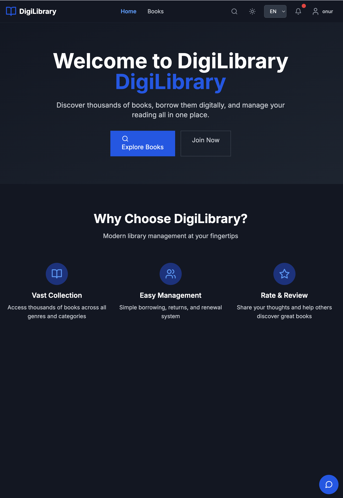
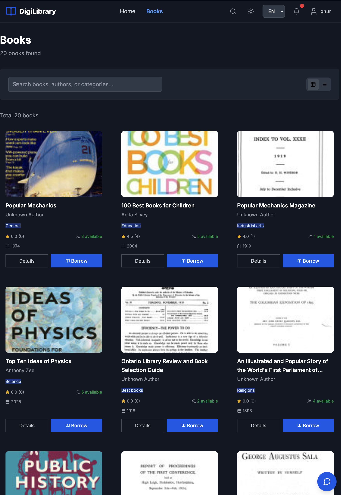
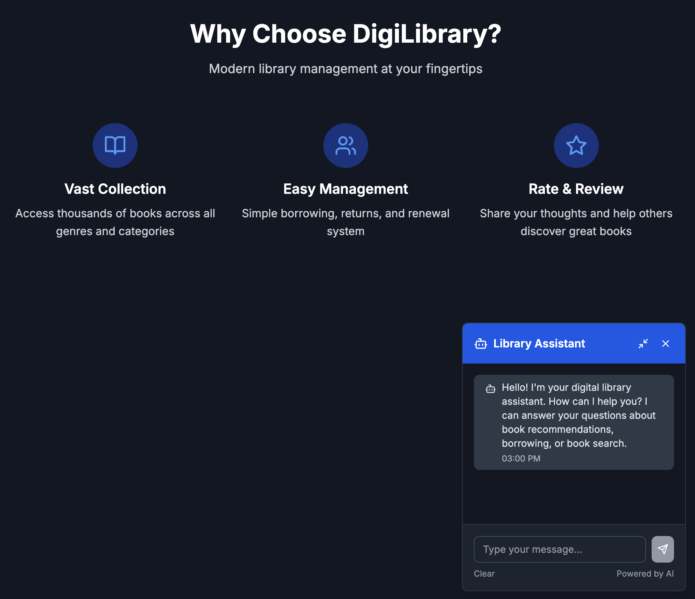
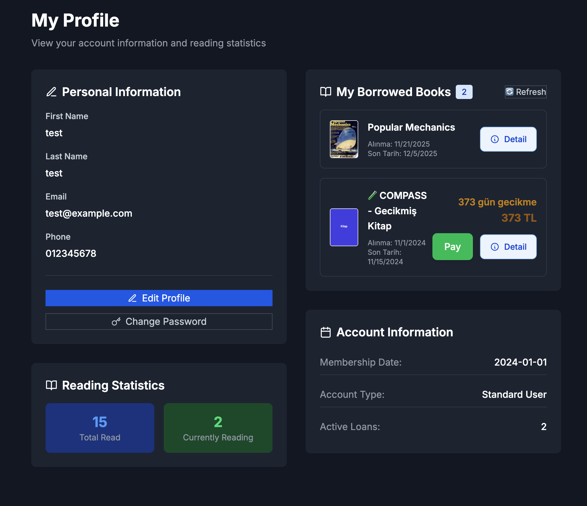

# DigiLibrary - Digital Library Management System

A modern, full-stack digital library application with AI-powered chatbot, built with React, Node.js, and MongoDB. Features book management, user profiles, payment integration, and intelligent book recommendations.

## 📱 Screenshots

_(Add your application screenshots here - replace these placeholders with your actual screenshots)_

| Home & Dashboard              | Book Search                       | Chatbot Assistant                   |
| ----------------------------- | --------------------------------- | ----------------------------------- |
|  |  |  |

| Reading Interface                   | User Profile                        | Payment Process                     |
| ----------------------------------- | ----------------------------------- | ----------------------------------- |
|  |  |  |

## ✨ Features

### 📚 Book Management

- **Google Books API Integration**: Extensive book database access
- **Advanced Search**: Search by title, author, ISBN, or keywords
- **Book Categorization**: Organized by genres, authors, and collections
- **Reading Progress**: Track reading progress and bookmarks
- **Digital Bookshelf**: Personal library management

### 🤖 AI-Powered Chatbot

- **Google Generative AI Integration**: Intelligent book recommendations
- **Contextual Assistance**: Help with book discovery and queries
- **Personalized Suggestions**: AI-driven reading recommendations

### 💳 Payment System

- **Stripe Integration**: Secure payment processing
- **Subscription Plans**: Monthly/Yearly membership options
- **One-time Purchases**: Individual book purchases
- **Secure Transactions**: PCI-compliant payment handling

### 👤 User Management

- **User Profiles**: Personalized accounts and reading history
- **Authentication**: JWT-based secure authentication
- **Reading Lists**: Create and manage custom reading lists
- **Reviews & Ratings**: Community book reviews and ratings

### 🎨 Modern UI/UX

- **Responsive Design**: Mobile-first responsive design
- **Interactive Interface**: Smooth animations and transitions
- **Accessibility**: WCAG compliant design
- **Dark/Light Theme**: Dual theme support

## 🚀 Quick Start

### Prerequisites

- Node.js (v18 or higher)
- MongoDB (v5.0 or higher)
- npm or yarn

### Installation

1. **Clone the repository**

   ```bash
   git clone https://github.com/kapucuonur/digilibrary-app.git
   cd digilibrary-app
   ```

2. **Install dependencies**

   ```bash
   # Install client dependencies
   cd client
   npm install

   # Install server dependencies
   cd ../server
   npm install
   ```

3. **Environment Configuration**

   Create `.env` files in both `client` and `server` directories:

   **Server (.env)**

   ```env
   MONGODB_URI=mongodb://localhost:27017/digilibrary
   JWT_SECRET=your_jwt_secret_key
   JWT_EXPIRE=30d
   GOOGLE_BOOKS_API_KEY=your_google_books_api_key
   GOOGLE_GENERATIVE_AI_API_KEY=your_google_ai_api_key
   STRIPE_PUBLISHABLE_KEY=your_stripe_publishable_key
   STRIPE_SECRET_KEY=your_stripe_secret_key
   STRIPE_WEBHOOK_SECRET=your_stripe_webhook_secret
   PORT=5000
   NODE_ENV=development
   CLIENT_URL=http://localhost:3000
   ```

   **Client (.env)**

   ```env
   REACT_APP_API_URL=http://localhost:5000/api
   REACT_APP_STRIPE_PUBLISHABLE_KEY=your_stripe_publishable_key
   ```

4. **Database Setup**

   ```bash
   # Make sure MongoDB is running
   mongod
   ```

5. **Run the application**

   ```bash
   # Start the backend server (from server directory)
   cd server
   npm run dev

   # Start the frontend client (from client directory in new terminal)
   cd client
   npm start
   ```

6. **Access the application**
   - Frontend: http://localhost:3000
   - Backend API: http://localhost:5000

## 🛠️ Technology Stack

### Frontend

- **React** - UI framework
- **React Router** - Client-side routing
- **Axios** - HTTP client
- **Context API** - State management
- **CSS3** - Styling
- **Stripe.js** - Payment processing

### Backend

- **Node.js** - Runtime environment
- **Express.js** - Web framework
- **MongoDB** - Database
- **Mongoose** - ODM
- **JWT** - Authentication
- **bcryptjs** - Password hashing

### APIs & Services

- **Google Books API** - Book data
- **Google Generative AI API** - AI chatbot
- **Stripe API** - Payments

## 📁 Project Structure

```
digilibrary-app/
├── client/                 # React frontend
│   ├── public/            # Static files
│   ├── src/
│   │   ├── components/    # UI components
│   │   │   ├── common/    # Common components (BookCard, LoadingSpinner)
│   │   │   ├── layout/    # Layout components (Navbar, Footer)
│   │   │   ├── Chatbot/   # AI Chatbot components
│   │   │   └── PaymentModal.jsx
│   │   ├── pages/         # Page components
│   │   │   ├── Home.jsx
│   │   │   ├── Books.jsx
│   │   │   ├── BookDetail.jsx
│   │   │   ├── Dashboard.jsx
│   │   │   ├── Profile.jsx
│   │   │   ├── Login.jsx
│   │   │   ├── Register.jsx
│   │   │   └── admin/
│   │   │       └── AdminPanel.jsx
│   │   ├── contexts/      # React Context providers
│   │   │   ├── AuthContext.jsx
│   │   │   ├── ThemeContext.jsx
│   │   │   └── LanguageContext.jsx
│   │   ├── services/      # API service functions
│   │   │   └── api.js
│   │   ├── App.jsx        # Main App component
│   │   ├── main.jsx       # Application entry point
│   │   └── index.css      # Global styles
├── server/                 # Node.js backend
│   ├── controllers/       # Route controllers
│   ├── models/            # MongoDB models (User, Book, Order, etc.)
│   ├── routes/            # API routes (auth, books, users, payments, chatbot)
│   ├── middleware/        # Custom middleware (auth, error handling)
│   ├── config/            # Configuration files
│   └── utils/             # Utility functions
├── docs/                  # Documentation
├── screenshots/           # Application screenshots
└── README.md
```

## 🔧 API Configuration

### Google Books API

Get API key from [Google Cloud Console](https://console.cloud.google.com/)

### Google Generative AI API

Access through [Google AI Studio](https://makersuite.google.com/app/apikey)

### Stripe Configuration

Create account at [Stripe Dashboard](https://dashboard.stripe.com/)

## 📦 Deployment

### Production Build

```bash
# Build client
cd client
npm run build

# Start production server
cd ../server
npm start
```

## 🤝 Contributing

1. Fork the project
2. Create your feature branch (`git checkout -b feature/AmazingFeature`)
3. Commit your changes (`git commit -m 'Add some AmazingFeature'`)
4. Push to the branch (`git push origin feature/AmazingFeature`)
5. Open a Pull Request

## 📄 License

This project is licensed under the MIT License.

## 👤 Author

**Onur Kapucu**

- GitHub: [@kapucuonur](https://github.com/kapucuonur)

## 🙏 Acknowledgments

- Google Books API for book data
- Google Generative AI for chatbot features
- Stripe for payment processing
